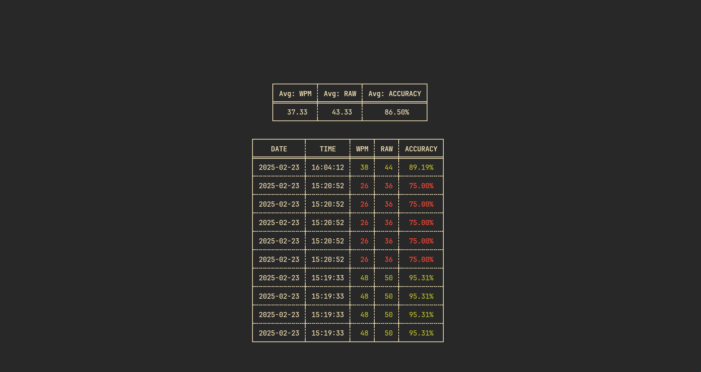

<div align="center">
  <pre>
,--------.,--.   ,--.,------.,--.   ,--.  
'--.  .--' \  `.'  / |  .--. '\  `.'  /  
   |  |     '.    /  |  '--' | '.    /   
   |  |       |  |   |  | --'    |  |    
   `--'       `--'   `--'        `--'    
  </pre>
</div>

> [!WARNING]  
> When the terminal is too small it can lead to strange behavior.

## Table of contents
- [Overview](#overview)
- [Installation](#installation)
- [Flags](#flags)
- [Configuration](#configuration)
- [Stats](#stats)
- [Uninstall](#uninstall)

## Overview

I wanted to create a simple typing game to improve my typing speed and accuracy. I really like using [monkeytype](https://monkeytype.com/) and I thought, why not create something similar
in the terminal? I searched for some but didn't find anything I really liked, so I built it myself. Typy is a terminal-based typing game that displays a random
word and asks you to type it as fast as possible. The game tracks your typing speed and accuracy, allowing you to monitor your progress over time. Typy also supports
different game modes, such as uppercase and punctuation, to help you improve your typing skills in different areas.

## Installation
To install Typy on Linux, you can use the following command:

```bash
curl -sSL https://raw.githubusercontent.com/Pazl27/typy-cli/master/scripts/install.sh | bash
```

This command downloads and runs the installation script from the Typy GitHub repository. The script will handle the installation process for you, ensuring that Typy is set up correctly on your system.

If you prefer to get the newest version and compile it yourself, follow these steps:

1. Clone the Typy repository:
    ```bash
    git clone https://github.com/Pazl27/typy-cli.git
    cd typy-cli
    ```

2. Compile the project:
    ```bash
    cargo build --release
    ```

3. Move the compiled binary to a directory in your PATH:
    ```bash
    sudo mv target/release/typy /usr/local/bin/
    ```

4. Ensure the `words.txt` file is in the correct location:
    ```bash
    mkdir -p ~/.local/share/typy
    cp resources/words.txt ~/.local/share/typy/
    ```

## Flags
The `Typy` application supports the following flags:

- `-t, --time <duration>`: Sets the duration of the game. The default value is `30`.
  - if you set the time to a too low value the graph ends up scuffed.
  - e.g., `typy-cli -t 60` sets the game duration to 60 seconds.

- `-s, --stats`: Shows the stats of the game.
  - not implemented atm.
  - e.g., `typy-cli --stats` displays the game statistics.

- `-c, --config`: Creates a config file if it doesn't exist and opens it.
  - e.g., `typy-cli --config` creates and opens the configuration file.

- `-m, --mode <mode>`: Sets the mode of the game. Multiple values can be specified.
  - possible modes are `uppercase`, `punctuation` and `normal`.
  - e.g., `typy-cli -m uppercase,punctuation` sets the game mode to uppercase and punctuation.


## Configuration
Typy allows you to configure the colors (theme) via a TOML file. The configuration file is located at `~/.config/typy/config.toml`. You can also configure Typy using the command line with the `typy -c` option.
Inside of the configuration file, you can specify the colors for the theme, graph, and cursor style. Also you can specify some default settings.

Here is an example configuration block for the `config.toml` file:

```toml
# ~/.config/typy/config.toml

[theme]
fg = "#516D49"
missing = "#918273"
error = "#FB4934"
accent = "#D3869B"

[graph]
data = "#8EC07C"
title = "#458588"
axis = "#B16286"

[cursor]
style = "SteadyBar" # possible options are: DefaultUserShape, BlinkingBlock, SteadyBlock, BlinkingUnderScore, SteadyUnderScore, BlinkingBar, SteadyBar,

[modes]
default_mode = "normal" # possible modes are "normal"|"uppercase"|"punctuation", combinations of modes is also possible e.g: "uppercase, punctuation"
uppercase_chance = "3" # possible are values between 0 and 1, if value is too high it gets clamped to 1, if too low it gets clamped to 0
punctuation_chance = "0.5" # possible are values between 0 and 1, if value is too high it gets clamped to 1, if too low it gets clamped to 0
```

To apply the configuration, you can either edit the `config.toml` file directly or use the `typy -c` command to to open the file in your preferred editor:

```bash
typy -c 
```

This allows you to customize the appearance of Typy to match your preferences.

## Stats
The stats are saved in a file located at `~/.local/share/typy/stats.json`. The stats file tracks the stats of the past 10 games. Also it shows the average WPM,
RAW and accuracy of the all games played.
To check your stats you can use the `typy --stats` command.

```bash
typy -s
```
This will display the stats of the last 10 games and looks something like this:

To close this view press `Ctrl + c` or `esc`.

## Uninstall
```bash
curl -sSL https://raw.githubusercontent.com/Pazl27/typy-cli/master/scripts/uninstall.sh | bash
```
